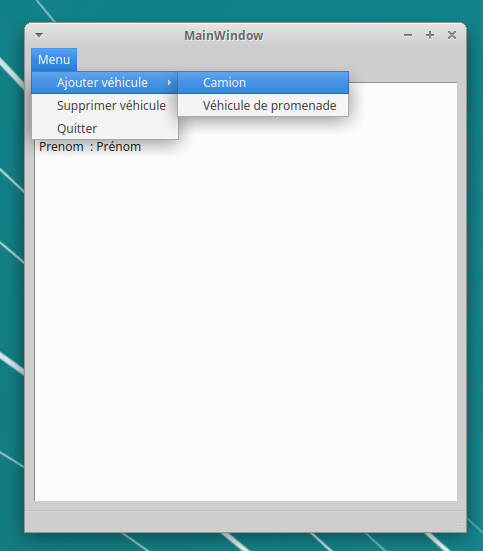
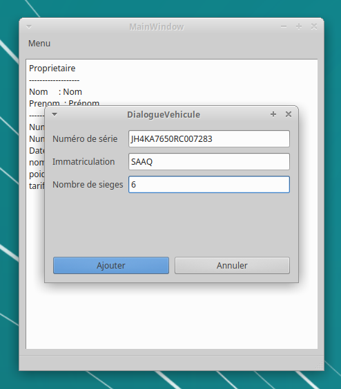
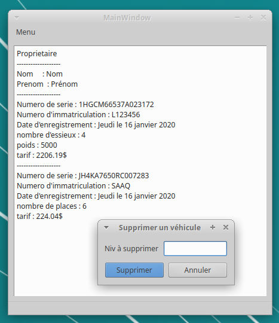

# Démo C++: gestion de véhicules

Ce programme, réalisé pour le cours "Programmation avancée en C++" (GIF-1003), à l'Université Laval, permet d'entrer et de valider des véhicules deux types: véhicules de promenades et camions.

Une interface graphique réalisée avec Qt donne accès à des formulaires pour valider les informations des véhicules, notamment en validant que le "[Numéro d'identification du véhicule](https://fr.wikipedia.org/wiki/Vehicle_Identification_Number)" (NIV) et le [numéro de plaque d'immatriculation](https://saaq.gouv.qc.ca/immatriculation/categories-plaques-immatriculation/) respectent les formats prescrits.

Il est ensuite possible d'ajouter des véhicules à un affichage ou d'en retirer en entrant leur NIV.

## Fenêtre principale

## Dialogue d'entrée de véhicules

Un dialogue équivalent pour entrer les informations d'un camion est aussi disponible. Le programme valide tous les champs.

## Dialogue de suppression de véhicules

Retourne une erreur si le numéro à supprimer ne fait pas partie de la liste de véhicules entrés.

Le code implémente la théorie du contrat et les tests unitaires sont réalisés avec Google Test.

*Environ 15% du code a été écrit par un coéquipier.*
